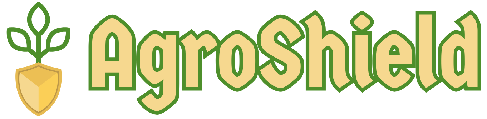

# ✨ AgroShield: Automatic Sliding Roof System 🌾
<p align="center">
  
</p>
Sistem AgroShield adalah solusi inovatif yang dirancang untuk merevolusi praktik pertanian melalui pemantauan cerdas dan analisis data real-time. Dengan mengintegrasikan teknologi terkini, AgroShield membantu petani mengambil keputusan yang lebih tepat untuk mengoptimalkan kondisi pertumbuhan tanaman, memitigasi risiko, dan pada akhirnya meningkatkan produktivitas serta kualitas hasil panen. 🧑‍🌾📈

## 👥 Anggota Kelompok
- Ratukhansa Salsabila - 18223034
- Fhatika Adhalisman Ryanjani - 18223062
- Gabriela Jennifer Sandy - 18223092

## 📜 Poster 
<p align="center">
  
</p>

## 📝 Deskripsi Sistem
AgroShield dikembangkan untuk memberdayakan petani dengan wawasan yang mendalam tentang lingkungan pertanian mereka. Sistem ini mengumpulkan data krusial dari berbagai sensor yang ditempatkan di lahan pertanian, kemudian memprosesnya untuk menghasilkan informasi yang mudah dipahami dan actionable. Kami berfokus pada kemudahan penggunaan dan akurasi data untuk memastikan petani dapat mengelola lahan mereka dengan lebih efisien dan berkelanjutan. 💧☀️

### Fitur-fitur utama yang menjadi inti dari AgroShield meliputi:

- Pemantauan Sensor Real-time: Menampilkan data langsung dari sensor seperti kelembaban tanah 🌡️, suhu udara, kelembaban udara, intensitas cahaya, dan pH tanah (jika relevan). Data disajikan dalam format yang mudah dibaca di dashboard.
- Analisis Data Historis & Tren: Menyediakan visualisasi data sensor dalam bentuk grafik interaktif 📊, memungkinkan pengguna untuk melacak perubahan, mengidentifikasi pola pertumbuhan, dan memprediksi kebutuhan tanaman di masa mendatang.
- Prakiraan Cuaca Terintegrasi: Menampilkan data prakiraan cuaca yang relevan dengan lokasi pertanian ☁️, membantu petani merencanakan aktivitas seperti penyiraman, pemupukan, atau perlindungan tanaman dari cuaca ekstrem.
- Sistem Rekomendasi Cerdas (Chatbot): Sebuah chatbot berbasis AI 🤖 yang berfungsi sebagai konsultan pertanian pribadi. Chatbot ini dapat memberikan saran berdasarkan data sensor terkini, membantu dalam identifikasi masalah (misalnya, kekurangan air, nutrisi berlebih), dan menawarkan solusi praktis.
- Notifikasi & Peringatan Dini: Mengirimkan notifikasi otomatis 🔔 ke perangkat pengguna saat parameter lingkungan melewati ambang batas optimal, seperti kelembaban tanah yang terlalu rendah atau suhu yang terlalu tinggi, memungkinkan intervensi cepat.
- Antarmuka Pengguna Intuitif (Dashboard): Dashboard yang dirancang dengan mempertimbangkan pengalaman pengguna (UX) yang optimal, mudah dinavigasi, dan dapat diakses dari berbagai perangkat (desktop, tablet, mobile). 📱💻
  
## ✨ Fitur Unggulan
- Dashboard Interaktif menyediakan visualisasi yang jelas dan ringkas dari semua data sensor penting di satu tempat. Petani dapat melihat status kesehatan tanaman secara sekilas.
- Analitik Data Mendalam menyediakan grafik interaktif yang memungkinkan eksplorasi data historis, identifikasi tren musiman, dan perbandingan performa antar periode tanam. 📈
- Asisten Chatbot Konsultan untuk mendapatkan saran ahli secara instan untuk pertanyaan seputar irigasi, nutrisi, pengendalian hama, dan penyakit berdasarkan data lingkungan pertanian Anda. 💬🌿

## 🚀 Cara Penggunaan
Persyaratan Sistem
Untuk menjalankan AgroShield, pastikan sistem Anda memenuhi persyaratan berikut:

- Sistem Operasi: Linux, Windows, atau macOS.
- Web Server: Apache 
- PHP: Versi 7.4 atau lebih tinggi.
- Composer: Manajer dependensi PHP.
- Database: MySQL/MariaDB.
- Node.js & npm/yarn: Untuk mengelola dependensi frontend (jika ada).
- Perangkat IoT: Perangkat mikrokontroler (misalnya, ESP32, NodeMCU) yang dilengkapi dengan sensor tanah (kelembaban, pH), suhu, kelembaban udara, dan intensitas cahaya, serta memiliki konektivitas internet untuk mengirim data ke sistem. 🔌📡

## 💻 Instalasi Cepat

Ikuti langkah-langkah di bawah ini untuk mengatur dan menjalankan proyek AgroShield di lingkungan lokal Anda:

### ⚙️ Persyaratan Sistem

Pastikan Anda memiliki hal-hal berikut sebelum memulai:

* **Web Server:** Apache atau Nginx (direkomendasikan)
* **PHP:** Versi 7.4 atau lebih tinggi
* **Composer:** Untuk manajemen dependensi PHP
* **Database:** MySQL/MariaDB (direkomendasikan)
* **Node.js & npm/yarn:** Untuk mengelola dependensi frontend (jika ada).
* **Perangkat IoT:** Perangkat mikrokontroler (misalnya, ESP32, NodeMCU) yang dilengkapi dengan sensor tanah (kelembaban, pH), suhu, kelembaban udara, dan intensitas cahaya, serta memiliki konektivitas internet untuk mengirim data ke sistem. 🔌📡

### ⬇️ Langkah-langkah Instalasi

1.  **Clone Repositori:**
    Mulai dengan mengunduh kode sumber proyek dari repositori [AgroShield di GitHub](https://github.com/fhatikaadr/AgroShield):
    ```bash
    git clone https://github.com/fhatikaadr/AgroShield.git
    cd agroshield
    ```

2.  **Instal Dependensi PHP:**
    Gunakan Composer untuk menginstal semua dependensi PHP yang diperlukan:
    ```bash
    composer install
    ```

3.  **Konfigurasi Lingkungan (`.env`):**
    * Buat salinan file `.env.example` dan ganti namanya menjadi `.env`:
        ```bash
        cp .env.example .env
        ```
    * Buka file `.env` dan sesuaikan pengaturan database Anda (`database.default.hostname`, `database.default.database`, `database.default.username`, `database.default.password`).
    * Pastikan `CI_ENVIRONMENT = development` untuk mode pengembangan.
    * Hasilkan APP KEY baru untuk keamanan aplikasi Anda:
        ```bash
        php spark key:generate
        ```

4.  **Migrasi Database:**
    Jalankan migrasi database untuk membuat struktur tabel yang diperlukan:
    ```bash
    php spark migrate
    ```

5.  **Seed Data (Opsional):**
    Jika Anda ingin mengisi database dengan data contoh untuk pengujian atau demo, jalankan seeder:
    ```bash
    php spark db:seed ExampleSeeder
    ```

6.  **Konfigurasi Web Server (Apache/Nginx):**
    Arahkan `Document Root` server web Anda ke direktori `public` di dalam proyek `agroshield`.

    * **Untuk Apache:**
        Pastikan modul `mod_rewrite` diaktifkan dan file `.htaccess` di direktori `public` sudah dikonfigurasi dengan benar untuk penulisan ulang URL.

    * **Untuk Nginx:**
        Berikut adalah contoh konfigurasi server dasar. Sesuaikan `server_name` dan `root` dengan pengaturan Anda:
        ```nginx
        server {
            listen 80;
            server_name agroshield.test; # Ganti dengan domain/IP Anda
            root /path/to/agroshield/public; # Ganti dengan path absolut proyek Anda

            index index.php index.html index.htm;

            location / {
                try_files $uri $uri/ /index.php?$query_string;
            }

            location ~ \.php$ {
                include fastcgi_params;
                fastcgi_pass unix:/var/run/php/php7.4-fpm.sock; # Sesuaikan dengan versi PHP-FPM Anda
                fastcgi_index index.php;
                fastcgi_param SCRIPT_FILENAME $document_root$fastcgi_script_name;
            }

            # Optional: Hide .env and other sensitive files
            location ~ /\.env {
                deny all;
            }
        }
        ```

### ▶️ Menjalankan Aplikasi

Setelah semua langkah instalasi dan konfigurasi selesai, Anda bisa mengakses sistem AgroShield melalui browser web Anda di `http://localhost:8080` atau domain yang Anda konfigurasikan.

Untuk pengembangan, Anda juga bisa menggunakan server bawaan CodeIgniter:

```bash
php spark serve
```

## 🛠️ Teknologi yang Digunakan
AgroShield dibangun dengan kombinasi teknologi modern untuk memastikan skalabilitas, kinerja, dan kemudahan pengembangan:

- Backend Framework: CodeIgniter 4 (PHP)
- Database: MySQL / MariaDB 🗄️
- Frontend: HTML5, CSS3, JavaScript
- Visualisasi Data: Chart.js 📈
- Integrasi API: OpenWeatherMap API (untuk prakiraan cuaca) ☁️
- IoT Platform: Broker HTTP untuk menerima data dari sensor. 💡
